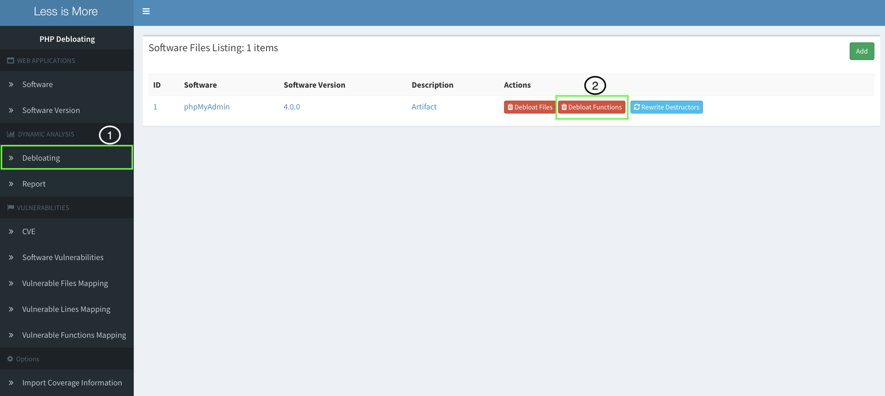

Minimalist
=========

This repository contains the code for our prototype implementation of Minimalist,
described in our USENIX 2023 paper.

Minimalist is a semi-automated approach to debloat PHP web applications. Here,
we provide instructions for building Minimalist's individual components.

## Folder Organization
The folder organization is listed below.
```bash
.
|-- basic_test.sh      # Runs initial test of Minimalist.
|-- prepare.sh         # Downloads required packcages and LIM dockers.
|-- step_1.sh          # Automates the process of downloading, preparing the env., and buliding Minimalist docker
|-- step_2.sh          # Builds LIM dockers.
|-- auto_import.sh     # Builds Pyton docker, and auto import Minimalist results to LIM.
|-- exploit.sh         # Exploits phpMyAdmin vulnerability. 
|-- basic_test
      |-- dockerfile   # Dockerfile for building the initial environment for Minimalist
      |-- webapp       # The sample web application to run basic test on Minimalist
|-- step-1
      |-- dockerfile   # Dockerfile for building the experimental environment for Minimalist
      |-- run.sh       # The bash script which runs the Minimalist analysis in the docker
      |-- data         # Includes necessary data and the static analysis of Minimalist
|
|-- step-2             # Less is More dockerfiles 
|-- auto_import        # Contains the dockerfile and Python script to import Minimalist result to LIM
|-- exploit            # Includes the Proof of Concept for the phpMyAdmin vulnerability. 
      |-- dockerfile   # Dockerfile to prepare the environment to run exploit.py
      |-- exploit.py   # The python script to exploit CVE-2013-5003
```

## Instructions

The debloating process of Minimalist divides into two separate phases:

1. Analysis of the PHP web application
    * Minimalist generates the call-graph of the PHP web application. 
    * Minimalist prunes the call-graph based on the set of prior visited entry-points.
2. Debloating the PHP web application
    * Minimalist imports its result into the LIM docker containers.
    * LIM debloats the web application 

To facilitate the evaluation of Minimalist, most of our instructions are based
around Docker containers. In phase one, we create one Docker for the first step,
which analyzes the web application and generates the output. The output of this
step is the set of functions that remains in the web application after
debloating. For the second phase, we use LIM to debloat the web application. To
do that, we create a set of Dockers (using `docker-compose`), import the
results of Minimalist to LIM using its interface, and debloat the web
application.


## Phase 0 - Downloading Packages

In order to run Minimalist, you need to download proper dependancies and
packages. To do this, run the following command to download libraries, LIM
dockers, and phpMyAdmin 4.0.0.

```
./prepare.sh
```

## Phase 1 - Analysis of Web App

In this phase, Minimalist analyzes the web application, generates its
call-graph, and identifies the set of functions that needs to be debloated.

`step_1.sh` builds all the dockers for this phase. First, `step_1.sh` downloads
phpMyAdmin 4.0 from its respective repository, unzips, configures, and moves
the web application to the `data` directory. Next, `step_1.sh` builds the
Minimalist Docker container and runs the analysis over phpMyAdmin 4.0. At the
end of this phase, Minimalist Docker generates the results in the `result`
directory. To perform this analysis, run the following command:

```
./step_1.sh
```

## Phase 2 - Debloating of Web App using LIM

In this phase, Minimalist uses the LIM interface to debloat web applications. 

`step_2.sh` copies the web application to the LIM directory, builds the dockers,
and runs the LIM's admin on port `8086`. You can access the LIM admin page on:

```
http://localhost:8086/admin/
```

Next, you can upload the Minimalist results either automatically or through the
user-interface provided by the LIM.

*Note: Use a different terminal for the rest of the artifact. For more
information on LIM UI, you can visit this
[link](https://lessismore.debloating.com/walkthrough.html).*

#### Automatic Import of Minimalist results

You can use the `post.py` python script to upload the result of Minimalist to
LIM. Note that, the script only works for the current artifact. To facilitate
the auto-import process, you can run the following command to create a docker
and run the `post.py` script:

```
./auto_import.sh
```

#### Import Minimalist results using the LIM interface

In order to manually upload Minimalist results, visit the following link and
fill out the form.

```
http://localhost:8086/admin/import_coverage/import
```

In the case of phpMyAdmin 4.0, you can fill out the form using the following
inputs and click *"Submit"*.As shown in the following figure, fill out the red
square inputs and click on the green button.


```
Software Version: phpMyAdmin 4.0.0
Original Path Prefix: Leave blank
New Path Prefix: /var/www/html/4.0.0/
Test Name: Artifact
File Type: Function Coverage
File: Path to the Minimalist output
```


*Note that, the uploading process takes up to 20 minutes to finish*
### Debloat Web Application using LIM

In order to debloat a web application, we use LIM's interface. To do so, we
need to add a new debloating target in LIM. Visit the following link and click
on the *"Add"* button on the top right corner, to add a new target for
debloating, fill out the form, and click *"Populate Database"*.

```
http://localhost:8086/admin/software_file/description
```

In the case of phpMyAdmin 4.0, you can fill out the form using the following
inputs. As shown in the following figure, fill out the red square inputs and
click on the green button.


```
Software: phpMyAdmin
Version: 4.0.0
Web Application Directory: /var/www/html/4.0.0
Description: Artifact_Debloating
```


In the last step, you can debloat the web application by clicking on **Debloat
Functions**.



## Examine the Removed Vulnerability

In order to examine the status of vulnerabilities in debloated web
applications, you can visit the following link and click on *"Covered
Vulnerabilities"*. The **X** on the Trigger column shows that vulnerability is
removed.


```
http://localhost:8086/admin/report
```

In the case of phpMyAdmin, you can see that Minimalist debloating process
removes the vulnerabilities identified by `CVE-2013-5003`. There is a PoC for
this vulnerability in the `exploit` directory for phpMyAdmin 4.0. Use the
following command to run the exploit against debloated phpMyAdmin 4.0.

```
./exploit.sh
```

The PoC performs a timing-based SQLi exploit against phpMyAdmin, which takes
the server more than 5 seconds to respond to the request if the exploit is
successful. Otherwise, the response is immediate.

## BibTeX for Citations
```
@inproceedings {minimalist,
author = {Rasoul Jahanshahi, Babak Amin Azad, Nick Nikiforakis, and Manuel Egele},
title = {Minimalist: Semi-automated {Debloating} of {PHP} {Web} {Applications} through {Static} {Analysis}},
booktitle = {{USENIX} Security Symposium},
year = {2023},
publisher = {{USENIX} Association},
month = aug,
}

```

## Contact Us

If you require any further information, send an email to `rasoulj@bu.edu`
